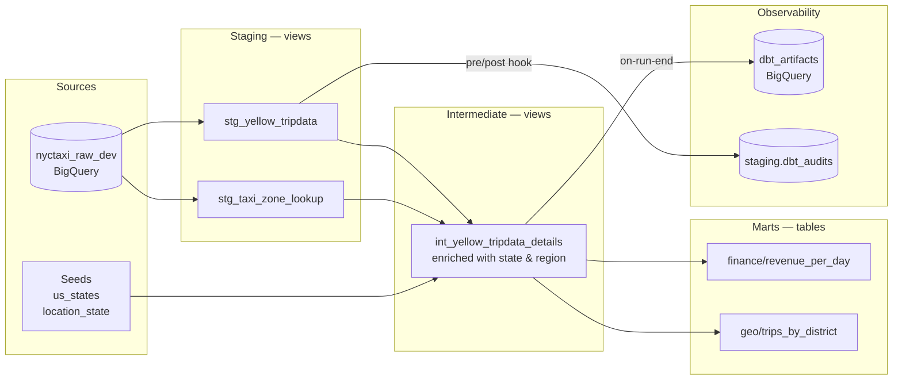

# dbt NYC Taxi · BigQuery


ELT transformation layer on NYC Yellow Taxi trip data, built with dbt-core on BigQuery.
3-layer medallion architecture (staging → intermediate → marts), custom data quality macros, and full observability via dbt_artifacts.

> Raw data is ingested via a separate IaC pipeline: [messaoudia/nyc-taxi-gcp-pipeline](https://github.com/messaoudia/nyc-taxi-gcp-pipeline)

## Disclaimers

> [!NOTE]
> - ℹ️ This project is in work in progress 🏗️
> - ✍️ Handwritten code — I can explain every technical decision in this codebase.

---

## Architecture



---

## Layers at a glance

| Layer | Models | Materialization | What happens here |
| --- | --- | --- | --- |
| **Staging** | `stg_yellow_tripdata`, `stg_taxi_zone_lookup` | View | Column renaming, null coalescing, FK tagging. No business logic. |
| **Intermediate** | `int_yellow_tripdata_details` | View | Enrichment via 2× joins on zone lookup + 2 seeds (state, region) |
| **Marts** | `revenue_per_day`, `trips_by_district` | Table | Aggregations for analytics consumers |
| **Seeds** | `us_states`, `location_state` | Table | Version-controlled reference data (265 TLC zones → US states) |

**Why views for staging/intermediate?** Storage cost stays at zero — these are never queried directly by end users. Tables only where query performance matters (marts).

---

## Testing & Data Quality

Built-in tests: `unique`, `not_null`, `relationships` on PKs and FKs across all layers.

Custom macro tests encoding business rules:

| Test | Model | Rule |
| --- | --- | --- |
| `max_tip_amount` | `stg_yellow_tripdata` | `tip_amount > $1200` → anomaly (variable-configurable) |
| `is_nyc_location_only` | `int_yellow_tripdata_details` | All trips must originate/terminate in New York State |

```yaml
# dbt_project.yml — threshold exposed as variable, not hardcoded
vars:
  max_tip_amount: 1200
```

---

## Observability

- **Audit logging** — `create_if_not_exists_audits_table()` + `insert_audit()` macros called via `on-run-start`, `on-run-end`, and model-level pre/post hooks → every run is tracked in `staging.dbt_audits`
- **dbt_artifacts** — [brooklyn-data/dbt_artifacts v2.10.0](https://github.com/brooklyn-data/dbt_artifacts) uploads execution metadata (run results, test results, model timing) to BigQuery after each run
- **BigQuery labels** — all models and seeds carry `created_by: dbt` label for resource tracking and cost attribution

---

## When to use dbt

| Context | Use dbt | Skip dbt |
| --- | --- | --- |
| Warehouse | BigQuery, Redshift, Databricks, DuckDB | OLTP (Postgres, MySQL) already modelized |
| Volume | Large, regularly refreshed datasets | One-shot transformations, small scripts |
| Team | Multi-contributor, code review, CI/CD | Solo... but who does that? :D |
| Quality | Versioned transformations + data testing | No testing needs — bad practice anyway |

---

## Quick start

```bash
pip install -r requirements.txt

# Configure your BigQuery profile in ~/.dbt/profiles.yml

dbt debug          # check connection
dbt deps           # install dbt_artifacts package
dbt seed           # load reference tables
dbt run            # build all models
dbt test           # run all tests
```

---

## Sources

- [dbt introduction](https://docs.getdbt.com/docs/introduction)
- [dbt best practices — project structure](https://docs.getdbt.com/best-practices/how-we-structure/1-guide-overview?version=1.12)
- [dbt best practices — staging](https://docs.getdbt.com/best-practices/how-we-structure/2-staging?version=1.12)
- [brooklyn-data/dbt_artifacts](https://github.com/brooklyn-data/dbt_artifacts)
- NYC TLC trip record data
